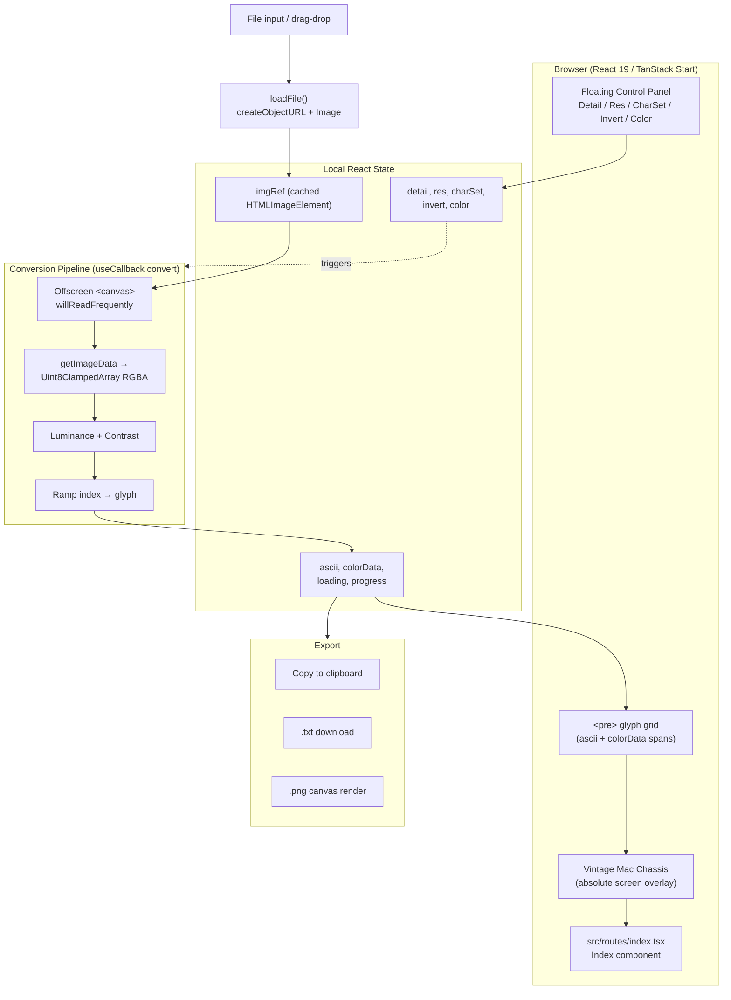
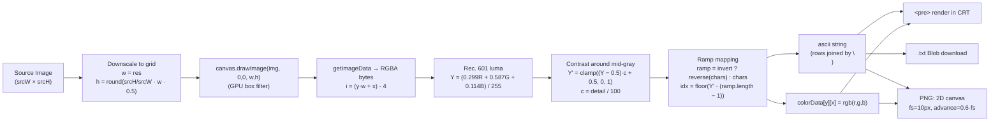

```
   ___   _____ _____ _____ _____   _____                  _             _
  / _ \ /  ___/  __ \_   _|_   _| |_   _|                (_)           | |
 / /_\ \\ `--.| /  \/ | |   | |     | | ___ _ __ _ __ ___  _ _ __   __ _| |
 |  _  | `--. \ |     | |   | |     | |/ _ \ '__| '_ ` _ \| | '_ \ / _` | |
 | | | |/\__/ / \__/\_| |_ _| |_    | |  __/ |  | | | | | | | | | | (_| | |
 \_| |_/\____/ \____/\___/ \___/    \_/\___|_|  |_| |_| |_|_|_| |_|\__,_|_|
```

# ASCII Terminal — Vintage Mac Edition

> Drop an image into a 1984-era Macintosh CRT and watch it dissolve into glowing phosphor-green ASCII. Pixels in, glyphs out — rendered entirely in your browser, no server round-trips.

---

## Core Features

- **Interactive Mac/CRT frame** — a full-page vintage Macintosh chassis with a live, drop-target screen inset (drag any image onto the glass or click to browse).
- **Live image-to-ASCII conversion** — re-renders on every parameter change, instantly, against the cached source bitmap.
- **Floating control panel** — neon-green chrome with:
  - **Detail** slider (20–200%) — contrast pivot around mid-gray.
  - **Resolution** slider (40–240 columns) — output grid width in characters.
  - **Character matrix** dropdown — Blocks, Standard, Minimal, Detailed, Binary.
- **CRT realism** — layered scanlines, phosphor noise dots, inset glow, dashed status header.
- **Toolbar actions** — Copy to clipboard, export `.txt`, export `.png`, Invert ramp, Color mode (per-glyph source RGB).
- **Animated loader** — phosphor progress bar with `Loading NN%` readout while the bitmap decodes.

---

## Tech Stack & Architecture

| Layer        | Choice                                                              |
|--------------|---------------------------------------------------------------------|
| Framework    | **React 19** on **TanStack Start v1** (Vite 7, file-based routing)  |
| Styling      | **Tailwind CSS v4** via `@import` in `src/styles.css`, oklch tokens |
| CRT FX       | Inline CSS: `repeating-linear-gradient` scanlines, radial phosphor dots, inset box-shadow glow, scoped `.ascii-slider` thumbs |
| Imaging      | HTMLCanvasElement 2D context (`willReadFrequently: true`), `getImageData`, offscreen render-to-canvas for PNG export |
| State        | Local React state + `useCallback` / `useMemo` / `useRef` — no store, no server functions |
| Assets       | Generated background and Mac chassis PNGs imported as ES modules    |

**Route shell.** Single page at `src/routes/index.tsx`. Mac chassis is positioned with `aspectRatio: 1/1` against `100vh`; the screen overlay is absolutely placed at `left: 21% / top: 20% / width: 58% / height: 47%` to land precisely inside the bezel art at any viewport.

---

## Architecture

High-level component, state, and pipeline layout. GitHub renders the diagram inline.



---

## Data Flow: image load → canvas read → luminance → ramp mapping → render/export



Plain-text fallback of the pipeline:

```
File ──► createObjectURL ──► .onload ──► imgRef (cached)
                                   │
                                   ▼
   slider/charset change ──► convert(img) ──► setAscii + setColorData
                                   │
                                   ▼
                            <pre> glyph grid  ──►  Copy / .txt / .png
```


## Under the Hood: The ASCII Conversion Engine

### 1. Downscale with monospace aspect correction

A target grid is computed from the source dimensions and the resolution slider:

```
w = res
h = round( (srcH / srcW) * w * 0.5 )
```

The `0.5` (≈ the canonical `~0.55` monospace correction) compensates for the fact that terminal glyphs are roughly **twice as tall as they are wide**. Without it, a portrait image would render stretched vertically by a factor of two. The image is drawn into an offscreen `<canvas>` at this exact grid so each canvas pixel corresponds to one output character cell — no per-cell sampling loop, the GPU rasterizer does the box filter for us.

### 2. Per-pixel luminance (Rec. 601 luma)

`getImageData` returns a flat `Uint8ClampedArray` of RGBA bytes. For each cell:

```
Y = (0.299 · R + 0.587 · G + 0.114 · B) / 255
```

This is the Rec. 601 luma — the perceptual-brightness twin of the Rec. 709 formulation `Y = 0.2126R + 0.7152G + 0.0722B`. Both weight green heaviest because the human eye is most sensitive to it; 601 is used here for closer fidelity to the 1980s CRT phosphor response the design evokes.

### 3. Brightness / contrast adjustment

The Detail slider applies a contrast curve pivoted on mid-gray so it stretches dynamic range without shifting exposure:

```
contrast = detail / 100                       // 0.2 … 2.0
Y' = clamp( (Y − 0.5) · contrast + 0.5,  0, 1 )
```

Fully transparent source pixels (`alpha < 32`) snap to `0` or `1` depending on invert state so PNGs with alpha never speckle the background.

### 4. Character-ramp mapping

Each character set is an ordered string from darkest → lightest:

```ts
Blocks:   " ░▒▓█"
Standard: " .:-=+*#%@"
Minimal:  " .:-=+*"
Detailed: " .'`^\",:;Il!i><~+_-?][}{1)(|/tfjrxnuvczXYUJCLQ0OZmwqpdbkhao*#MW&8%B@$"
Binary:   " 01"
```

The mapping is a direct index:

```
ramp = invert ? reverse(chars) : chars
idx  = floor( Y' · (ramp.length − 1) )
glyph = ramp[idx]
```

**Invert** simply reverses the ramp string — no second pass over the pixel buffer. **Color mode** stores `rgb(r,g,b)` in a parallel `colorData[y][x]` matrix and the renderer emits one `<span style={{color}}>` per glyph; PNG export rebuilds the same mapping onto a 2D canvas at `fs=10px` with a `0.6·fs` advance width to match monospace metrics.

---

## Local Installation & Deployment

### Prerequisites

- **Bun** ≥ 1.1 (recommended) or Node.js ≥ 20

### Clone & run locally

```bash
git clone https://github.com/<your-username>/<your-repo>.git
cd <your-repo>
bun install
bun run dev
```

The dev server prints a local URL (typically `http://localhost:5173`). Open it, drag an image onto the Mac screen, and tweak the sliders.

### Build for production

```bash
bun run build
```

Output is emitted to `.output/` (TanStack Start / Nitro). Preview the production build with:

```bash
bun run start
```

### Deploy

This is a TanStack Start app targeting an edge runtime — it deploys cleanly to any modern static / edge host. Pick one:

| Platform              | One-shot command                                  |
|-----------------------|---------------------------------------------------|
| **Cloudflare Pages**  | Connect the repo, build cmd `bun run build`, output `.output/public` |
| **Vercel**            | `vercel` — auto-detects the framework             |
| **Netlify**           | Connect the repo, build cmd `bun run build`       |
| **Lovable**           | Click **Publish** in the editor                   |

### Project layout

```
src/
├── routes/
│   ├── __root.tsx        # app shell
│   └── index.tsx         # the entire ASCII terminal app
├── assets/
│   ├── bliss-bg.jpg      # full-page wallpaper
│   └── vintage-mac.png   # Mac chassis art
└── styles.css            # Tailwind v4 + design tokens
```

---

## License

MIT — do whatever you want, just don't claim you invented ASCII art.
```
